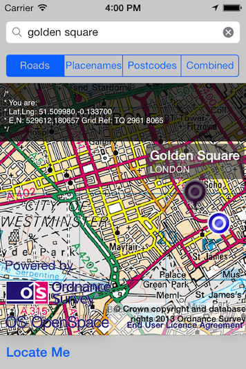

Description
---

A demo app using the iOS Openspace SDK to display the user's location to make use of location services.

Getting started
---

#### Register for an OS OpenSpace API Key

Developers will need to register and obtain an API Key for one of the [OS OpenSpace services](http://www.ordnancesurvey.co.uk/oswebsite/web-services/os-openspace/) in order to access the web mapping source.

#### Clone project

<pre>
git clone https://github.com/OrdnanceSurvey/ios-sdk-demo-locate-me.git
</pre>

#### Download ordnancesurvey-ios-sdk

 - Download the latest ordnancesurvey-ios-sdk static framework from [https://github.com/OrdnanceSurvey/ordnancesurvey-ios-sdk/downloads](https://github.com/OrdnanceSurvey/ordnancesurvey-ios-sdk/downloads) 
 - Unzip into the project directory root
 <pre>
 $SRCROOT/StaticFrameworks
 </pre>
 

#### Update demo app with your API Key

Copy and paste the API Key and associated URL into the demo app

Note: if an OS OpenSpace Pro account then change kIS_PRO to TRUE

<pre>
//In MapViewController.m

#define kOS_API_KEY @"YOUR_KEY_HERE"
#define kOS_URL @"YOUR_URL_HERE"
#define kIS_PRO FALSE

</pre>

#### Build and run

Project can now be built and run - if you're using the simulator dont forget to mock your location to London.

License
-------

Some notes about license & use TODO